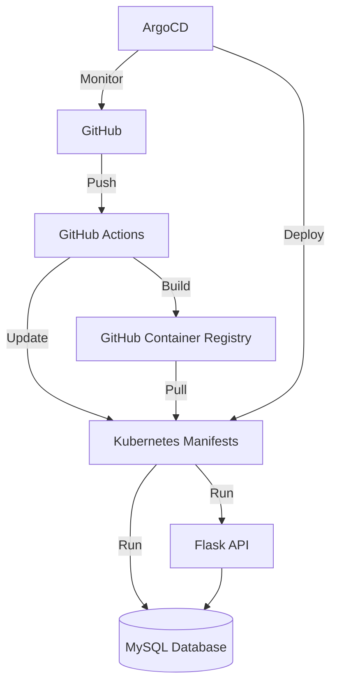

# Cloud Store Project

## Overview
Cloud Store is a cloud-based storage solution built with Flask, featuring secure authentication, MySQL database, and deployed using GitOps practices on Kubernetes.

## Architecture Overview


## Project Components

### Backend (Flask API)
- RESTful API with Flask
- JWT Authentication
- MySQL Database
- SQLAlchemy ORM
- Marshmallow for schemas

### Infrastructure
- Kubernetes deployment
- Kustomize for configuration management
- ArgoCD for GitOps
- GitHub Actions for CI/CD
- GitHub Container Registry for images

## Repository Structure

```
cloudstore/
├── backend/              # Flask application
│   ├── app/
│   │   ├── models/      # Database models
│   │   ├── schemas/     # Data serialization
│   │   ├── controllers/ # Business logic
│   │   └── views/       # API endpoints
│   ├── tests/           # Test suite
│   └── requirements/    # Python dependencies
├── k8s/                 # Kubernetes manifests
│   ├── base/           # Base configurations
│   └── overlays/       # Environment overlays
└── argocd/             # ArgoCD configurations
```

## Environment Setup
### Prerequisites

    Python 3.10+
    Docker
    Kubernetes cluster
    ArgoCD
    MySQL

### Required Secrets

    Database credentials
    JWT secrets
    GitHub tokens

## Development Workflow

### Local Development
# Database
```
flask db upgrade
flask db history
```

# Backend setup
```
bash
cd backend
python -m venv venv
source venv/bin/activate
pip install -r requirements/dev.txt
export FLASK_DEBUG=1
flask run
```

### Deployment Process
    1- Changes pushed to develop trigger:
        Unit tests
        Docker image build (dev-{SHA})
        Automatic deployment to dev environment

    2- ArgoCD manages:
        Kubernetes deployments
        Configuration changes
        Infrastructure state

### Testing
```
# Run backend tests
cd backend && pytest

# Test Kubernetes configs
kubectl kustomize k8s/overlays/dev
```


