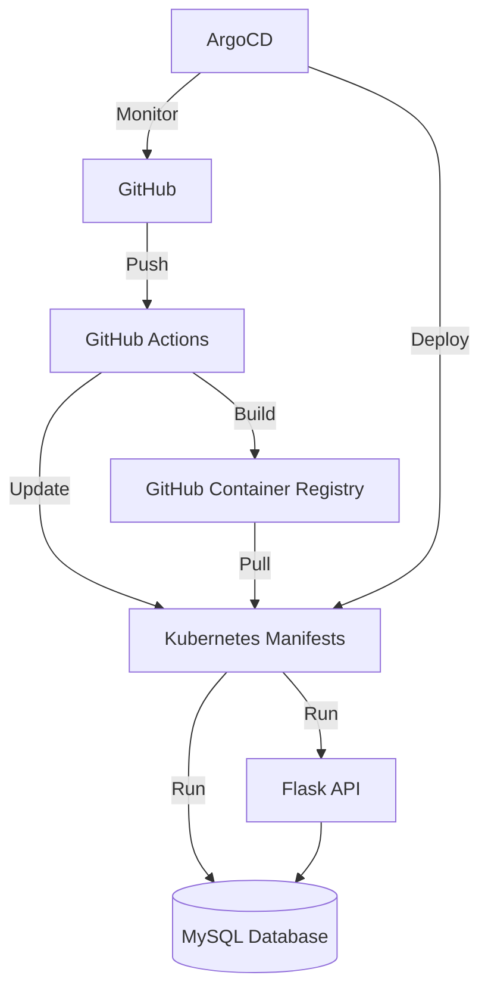

# Cloud Store Project

## Overview
Cloud Store is a cloud-based storage solution built with Flask, featuring secure authentication, MySQL database, and deployed using GitOps practices on Kubernetes.

## Architecture Overview


## Project Components

### Backend (Flask API)
- RESTful API with Flask
- JWT Authentication
- MySQL Database
- SQLAlchemy ORM
- Marshmallow for schemas

### Infrastructure
- Kubernetes deployment
- Kustomize for configuration management
- ArgoCD for GitOps
- GitHub Actions for CI/CD
- GitHub Container Registry for images

## Repository Structure

```
cloudstore/
├── backend/              # Flask application
│   ├── app/
│   │   ├── models/      # Database models
│   │   ├── schemas/     # Data serialization
│   │   ├── controllers/ # Business logic
│   │   └── views/       # API endpoints
│   ├── tests/           # Test suite
│   └── requirements/    # Python dependencies
├── k8s/                 # Kubernetes manifests
│   ├── base/           # Base configurations
│   └── overlays/       # Environment overlays
└── argocd/             # ArgoCD configurations
```

## Environment Setup
### Prerequisites

    Python 3.10+
    Docker
    Kubernetes cluster
    ArgoCD
    MySQL

### Required Secrets

    Database credentials
    JWT secrets
    GitHub tokens

## Development Workflow

### Local Development
# Database setup
```bash
docker run -d --name  mysql -e MYSQL_USER=<desired_user> -e MYSQL_ROOT_PASSWORD=<desired_root_password> -e MYSQL_DATABASE=cloud_store -p 3306:3306 mysql:8
mysql -u root -p
CREATE USER '<desired_user>'@'localhost' IDENTIFIED BY 'desired_user_password>';
GRANT ALL PRIVILEGES ON cloud_store.* TO '<desired_user>'@'localhost';
FLUSH PRIVILEGES;
```

# Backend setup
```bash
# Clone repository
git clone https://github.com/saeedya/cloudstore.git
cd backend
python -m venv venv
source venv/bin/activate
pip install -r requirements/dev.txt
export FLASK_ENV=development
export FLASK_APP=run
export DATABASE_URL=mysql+pymysql://<desired_user>:<desired_user_password>@localhost:3306/cloud_store
export SECRET_KEY=<your-secret-key>
export FLASK_DEBUG=1
flask run
```
# Kubernetes setup
```bash
# Create namespace
kubectl create namespace dev

kubectl create secret docker-registry ghcr-secret   --docker-server=ghcr.io   --docker-username=saeedya   --docker-password=ghp_5Rgc5x6***************   --namespace=dev

# Apply manifests
kubectl apply -k k8s/overlays/dev
```

# ArgoCD Setup
```bash
# Install ArgoCD
kubectl create namespace argocd
kubectl apply -n argocd -f https://raw.githubusercontent.com/argoproj/argo-cd/stable/manifests/install.yaml

# Access UI
kubectl port-forward svc/argocd-server -n argocd 8080:443
```

### Deployment Process
    1- Changes pushed to develop trigger:
        Unit tests
        Docker image build (dev-{SHA})
        Automatic deployment to dev environment

    2- ArgoCD manages:
        Kubernetes deployments
        Configuration changes
        Infrastructure state

### Testing Strategy

Unit Tests
```bash
# Run backend tests
cd backend
pytest tests/ -v
```
K8s tests
```bash
# Validate manifests
kubectl kustomize k8s/overlays/dev

# Test deployment
kubectl apply -k k8s/overlays/dev --dry-run=client
```

### Monitoring and Maintenance


